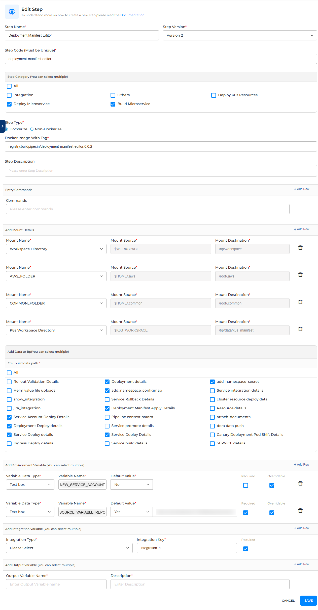

# **BP-DEPLOYMENT-MANIFEST-EDITOR**  
This script updates an already generated deployment.yaml with a new service account if an input is provided. 

## **Setup Instructions**  



### **1️⃣ Clone the Repository**  
Clone the project from the official repository:  
```bash
git clone --recurse-submodules https://github.com/OT-BUILDPIPER-MARKETPLACE/BP-DEPLOYMENT-MANIFEST-EDITOR
cd BP-DEPLOYMENT-MANIFEST-EDITOR
```

If you've already cloned the repository, ensure submodules are initialized and updated:  
```bash
git submodule init  
git submodule update  
```

---

### **2️⃣ Build the Docker Image**  
To build the Docker image, run:  
```bash
docker build -t registry.buildpiper.in/deployment-manifest-editor:$tag .
```

---

### **3️⃣ Local Testing**  
Run the container with environment variables and mount the current directory:  
```bash
docker run -it --rm -v "$PWD:/src" \
  -e VAR1="key1" -e VAR2="key2" \
  ot/<image-name>:0.1
```

---

### **4️⃣ Debugging**  
To enter a shell inside the container for troubleshooting:  
```bash
docker run -it --rm -v "$PWD:/src" \
  -e VAR1="key1" -e VAR2="key2" \
  --entrypoint sh ot/<image-name>:0.1
```

---

## **Notes**  
- Ensure **Docker** is installed and running before executing these commands.  
- Replace `<image-name>` with the actual image name used in your project.  

---